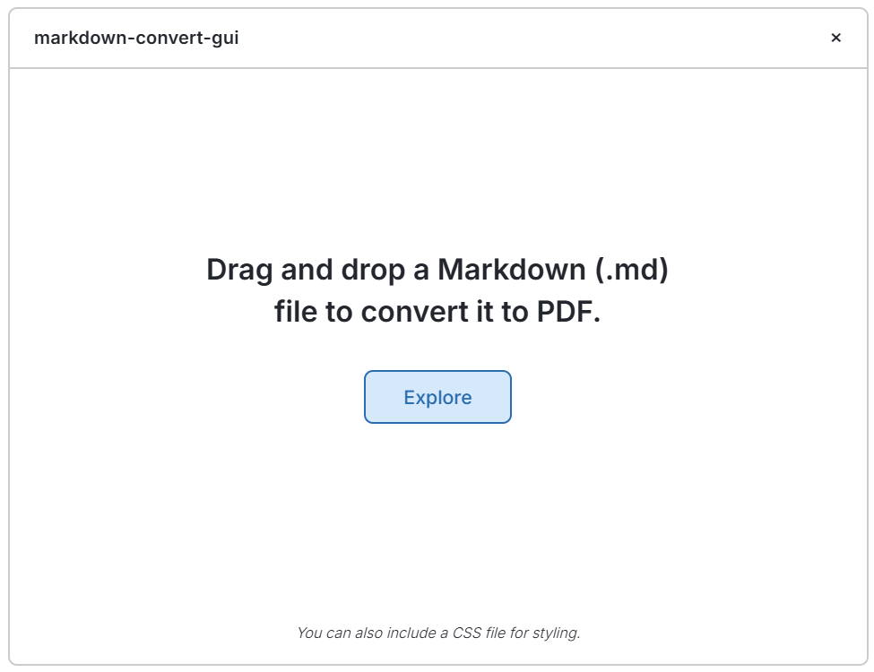

# markdown-convert-gui

<!--
[julynx.github.io/markdown-convert-gui](https://julynx.github.io/markdown-convert-gui/)
-->

_The official GUI for the [`markdown-convert`](https://pypi.org/project/markdown_convert/) Python package._

  

<!--

  
-->

## Features

- Drag and drop a Markdown (.md) document to convert it to pdf, or click to select it.
- You can also include a CSS file for styling.

- Automatically manages its own dependencies:
  - Checks for missing libraries at startup.
  - Installs everything that is needed with a single click.
  - Keeps the `markdown-convert` package up to date and in an isolated `uv` environment.

## Other

To learn more, check out the `markdown-convert` Python package on [GitHub](https://github.com/julynx/markdown-convert) or [PyPI](https://pypi.org/project/markdown_convert/).
